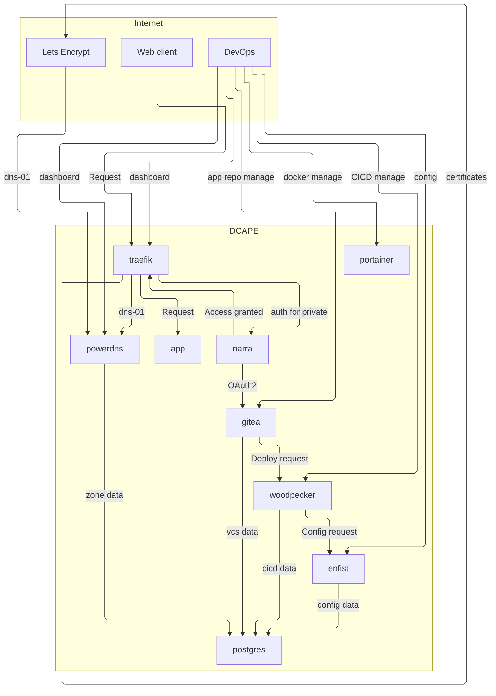
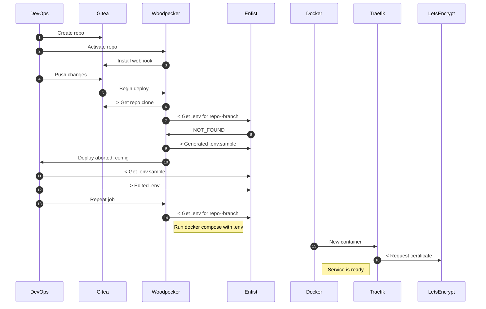
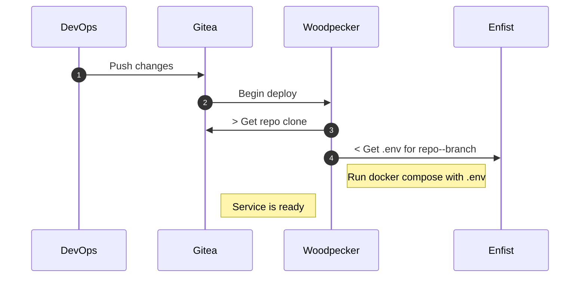
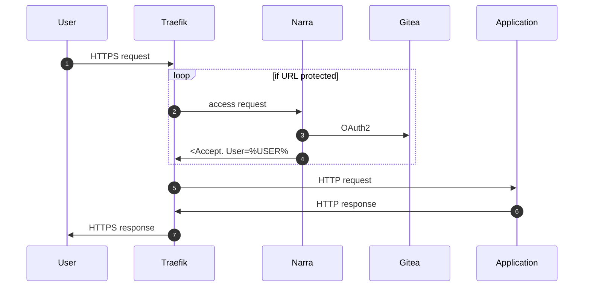

# dcape charts

## Arch


## Install dcape

```bash
MY_HOST=demo.dcape.ru
LE_ADMIN=admin@dcape.ru

git clone https://github.com/dopos/dcape.git
cd dcape
make install ACME=wild DNS=wild DCAPE_DOMAIN=${MY_HOST} \
  TRAEFIK_ACME_EMAIL=${LE_ADMIN} PDNS_LISTEN=$(dig +short $MY_HOST):53
make echo-gitea-admin-pass
```

TODO: скринкаст окна браузера, где мы

* создаем сервер у хостера
* заходим в консоль
* ставим гит и докер
* запускаем инсталл
* после установки - проверяем все сервисы

## Install app (1st Deploy)



## Update



## Serve


